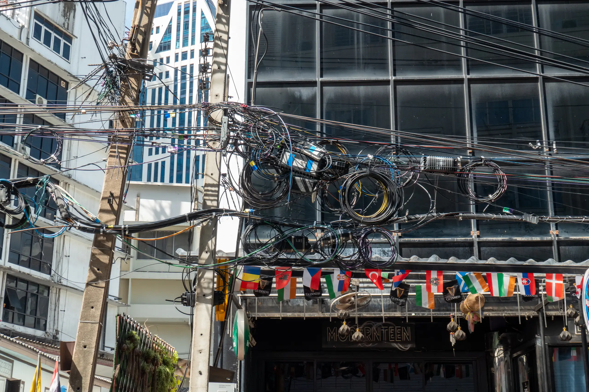
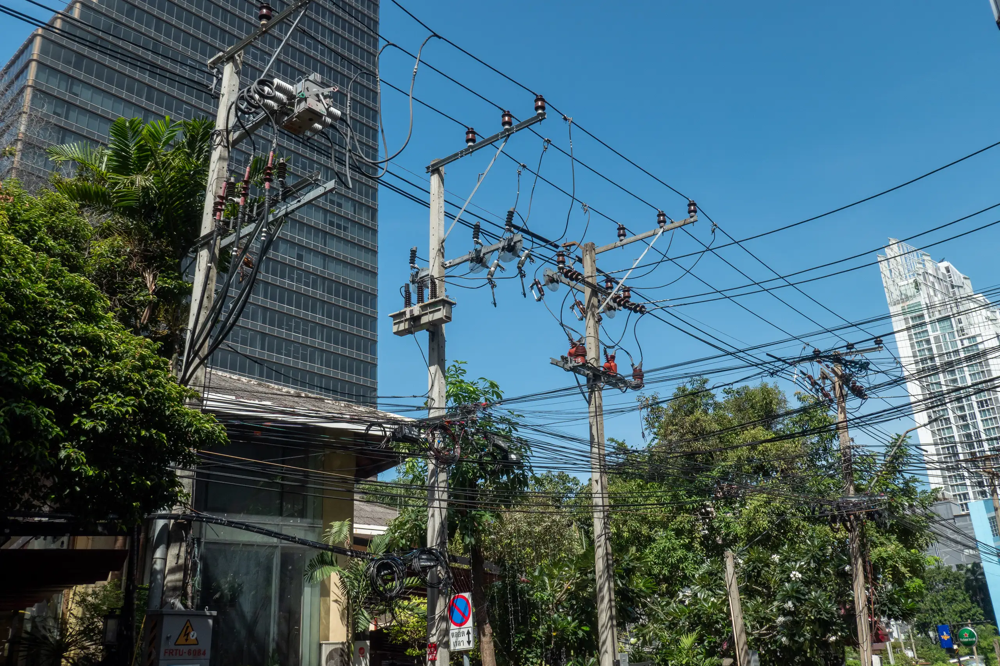
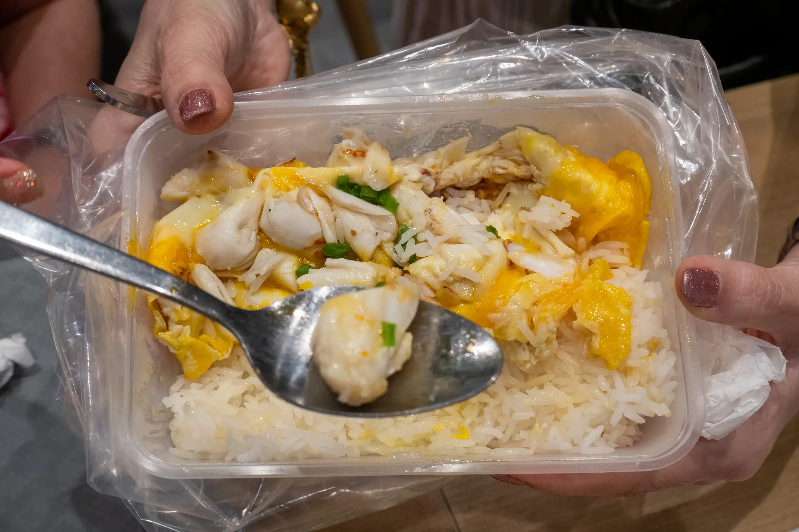

In the morning we bought tickets for the Calypso cabaret show and the day tour tomorrow from a travel agency called [Boarding Pass](https://www.boardingpass.co.th/main/index.php?action=home&lang=en) located near the Ambassador Hotel on Soi Sukhumvit 11, Klongtoey Nua, Wattana.

Along Soi Sukhumvit 11, I passed through more examples of cable art:

After that we headed to [Siam Paragon](https://www.siamparagon.co.th). Cat's friend Nuch owns a jewellery shop here called XAVIER BY UTHAI JEWELRY - [Facebook Page](https://www.facebook.com/xavierbyuthaijewelry/).

We also had lunch here at the Food Court on the Ground Floor. I had Thai Beef Noodle soup (Guay Tiew Nuea Nam Sai) and it was delicious. Aileen decided to order the crab omelette from Here Hai, a Michelins starred restaurant that as opened an outlet at the food court. It was delicious (I tried it), but it took nearly an hour for her to get the dish!

I also bought some Kipling bags at the Paragon Department Store. They offered to do the tourist VAT processing for me even though I don't have my passport with me - all I needed to show as a photo of my passport with the details on it.
