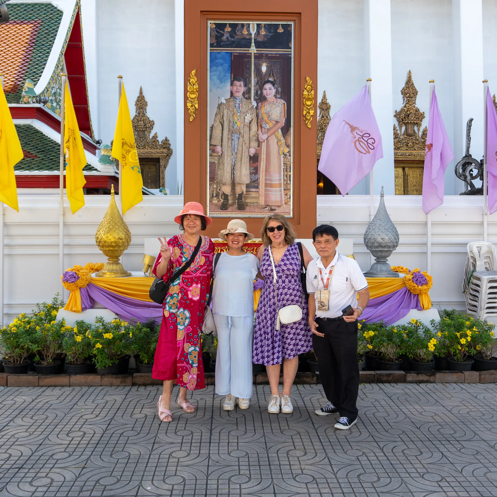
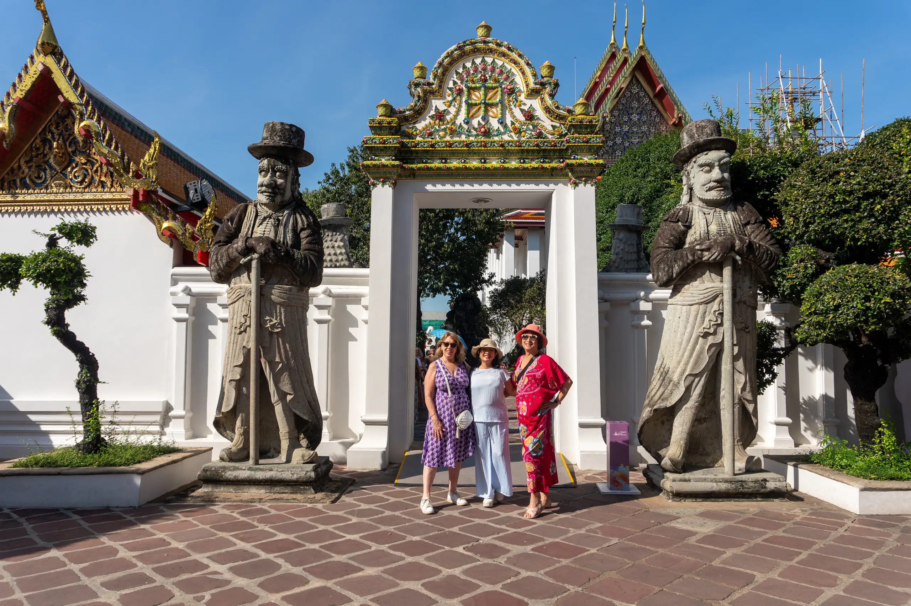
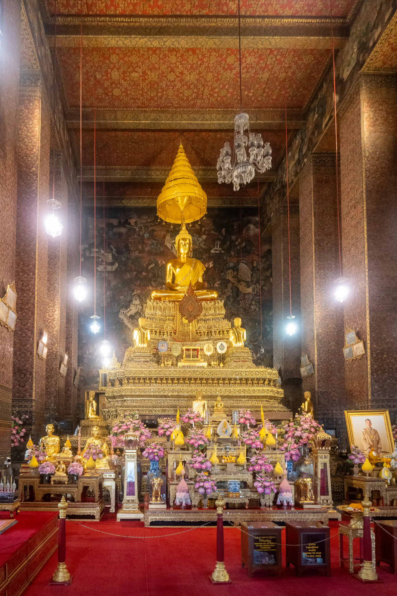
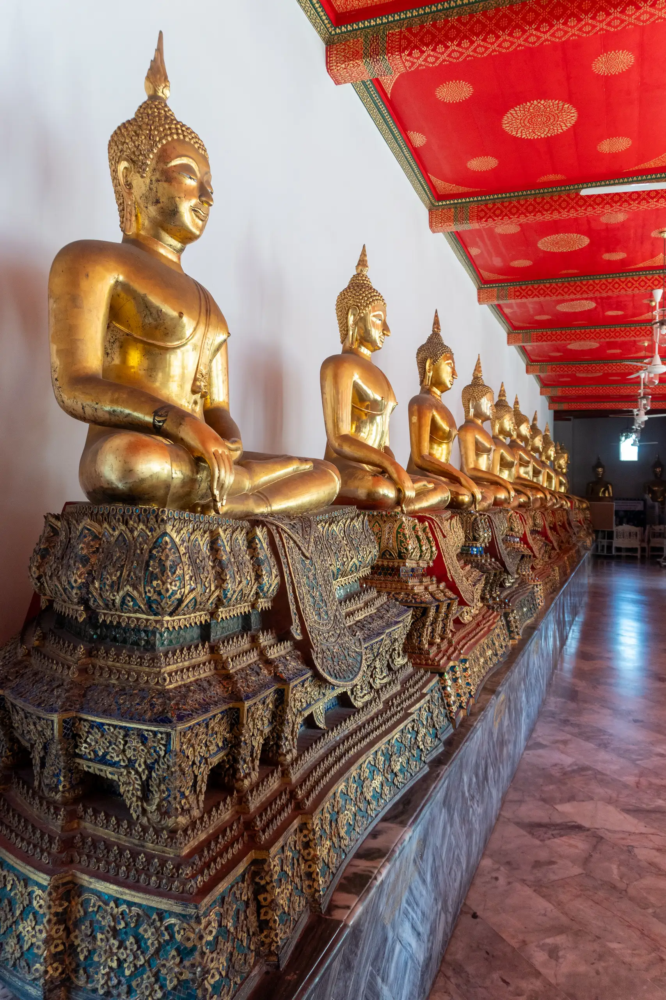
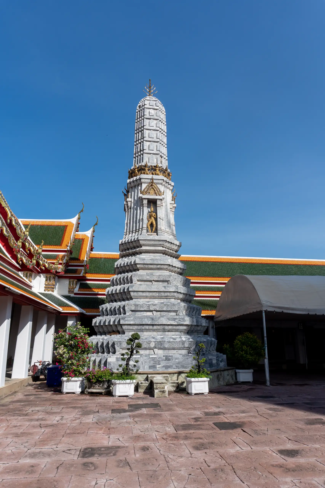
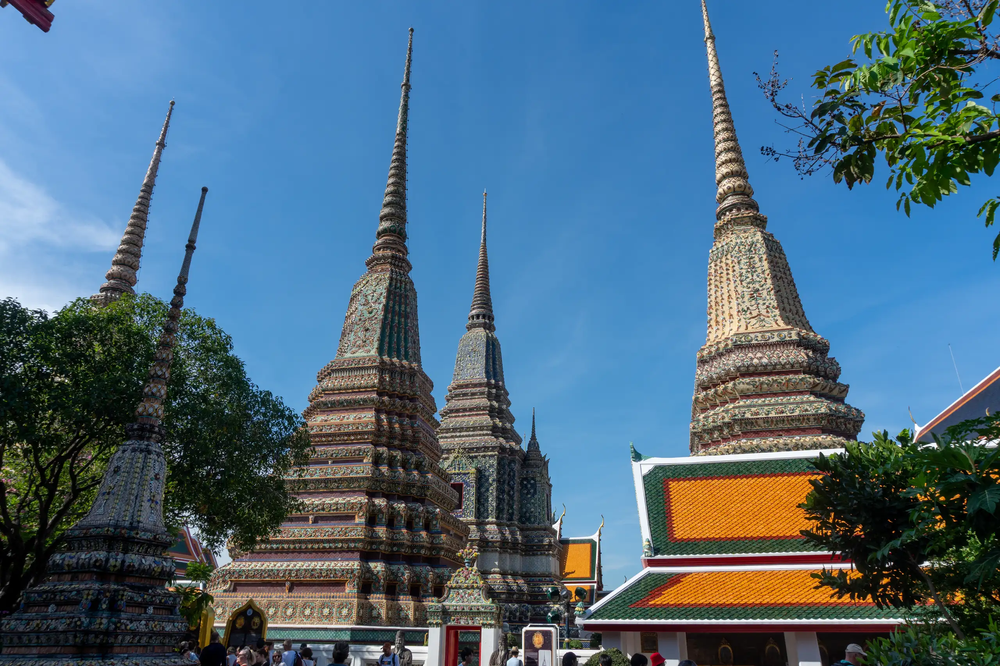
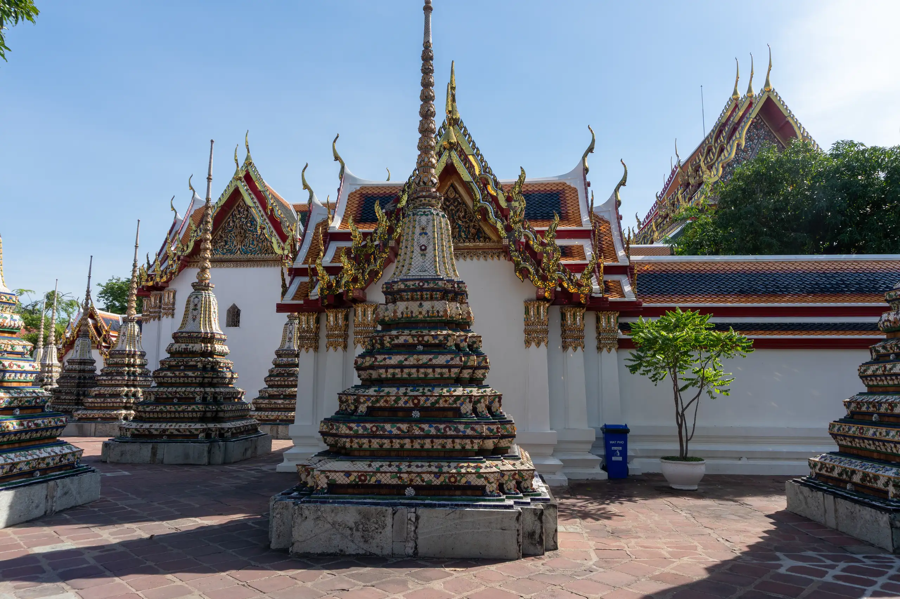
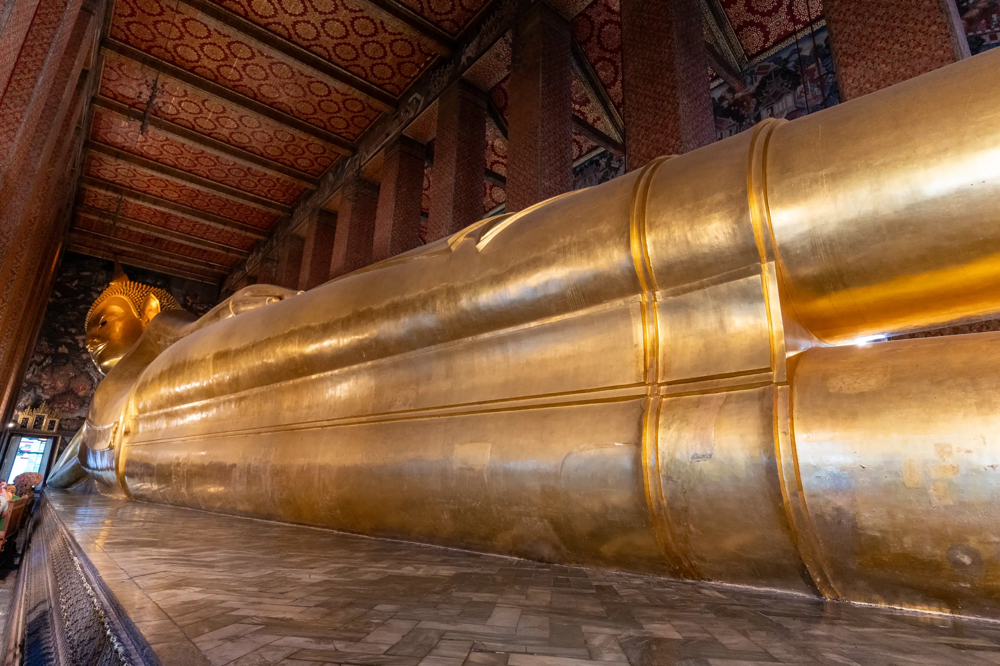

Our guide picked us up at 8:00AM and his name is Chuchai but he told us to call him "Bird". The temple and city half day tour includes the following:

- Grand Palace & Emerald Buddha
- Wat Pho (Reclining Buddha)
- Wat Arun (Temple of Dawn)
- Boat trip along the Klong (45-50 mins)

The first stop is Wat Pho.

Wat Pho is one of Bangkok's oldest temples. It existed before Bangkok was established as the capital by King Rama I. Our guide explained that King Rama I (Phra Bat Somdet Phra Phutthayotfa Chulalok Maharat พระบาทสมเด็จพระพุทธยอดฟ้าจุฬาโลกมหาราช) was the founder of the Rattanakosin Kingdom (now Thailand) and the first King of Siam from the reigning Chakri dynasty. He ascended the throne in 1782, following the deposition of King Taksin of Thonburi, who united Siam following the collapse of the Ayutthaya Kingdom but became mad in his later years (or so they say, perhaps they just wanted to get rid of him).

King Rama I decided to move the capital of Thailand from Thonburi to Bangkok, and decided to build the Grand Palace beside Wat Pho. He also decided to renovate Wat Pho. Originally, the temple site was named Wat Photaram or Podharam and it was renamed to Phra Chetuphon Vimolmangklavas. The temple complex continued to undergo changes over the next 200 years and was renamed Wat Phra Chetuphon Vimolmangklararm by King Rama IV.

It is home to more than one thousand Buddha images, as well as one of the largest single Buddha images at 46 metres (151 ft) in length. The Wat Pho complex consists of two walled compounds bisected by Chetuphon Road running in the east–west direction. The larger northern walled compound, the phutthawat, is open to visitors and contains the finest buildings dedicated to the Buddha, including the bot with its four directional viharn, and the temple housing the reclining Buddha. The southern compound, the sankhawat, contains the residential quarters of the monks and a school. The temple grounds contain four great chedis, 91 small chedis, two belfries, a bot (central shrine), a number of viharas (halls) and various buildings such as pavilions, as well as gardens and a small temple museum.

A number of large Chinese statues, some of which depict Europeans, are also found in the complex guarding the gates of the perimeter walls as well as other gates in the compound. These stone statues were originally imported as ballast on ships trading with China. One of these is apparently Marco Polo.

Phra Ubosot (Phra Uposatha) or bot is the ordination hall, the main hall used for performing Buddhist rituals, and the most sacred building of the complex. Inside the ubosot is a gold and crystal three-tiered pedestal topped with a gilded Buddha made of a gold-copper alloy, and over the statue is a nine-tiered umbrella representing the authority of Thailand. The Buddha image, known as Phra Buddha Theva Patimakorn, is thought to be from the Ayutthaya period.

Phra Rabiang is a double cloister contains around 400 images of Buddha from northern Thailand selected out of the 1,200 originally brought by King Rama I.

There are four towers, or phra prang, at each corner of the courtyard around the bot.

Phra Maha Chedi Si Rajakarn is a group of four large stupas, each 42 metres high. These four chedis are dedicated to the first four Chakri kings. The first, in green mosaic tiles, was constructed by Rama I to house the remnants of the great Buddha from Ayuthaya, which was scorched to remove its gold covering by the Burmese.

Outside the Phra Rabiang cloisters are dotted many smaller chedis, called Phra Chedi Rai. They contain ashes of the royal family and also relics of the Buddha.

The wat and the reclining Buddha (Phra Buddhasaiyas, Thai: พระพุทธไสยาสน์) were built by Rama III in 1832. The image of the reclining Buddha represents the entry of Buddha into Nirvana and the end of all reincarnations. The posture of the image is referred to as sihasaiyas, the posture of a sleeping or reclining lion. The figure is 15 m high and 46 m long, and it is one of the largest Buddha statues in Thailand.

