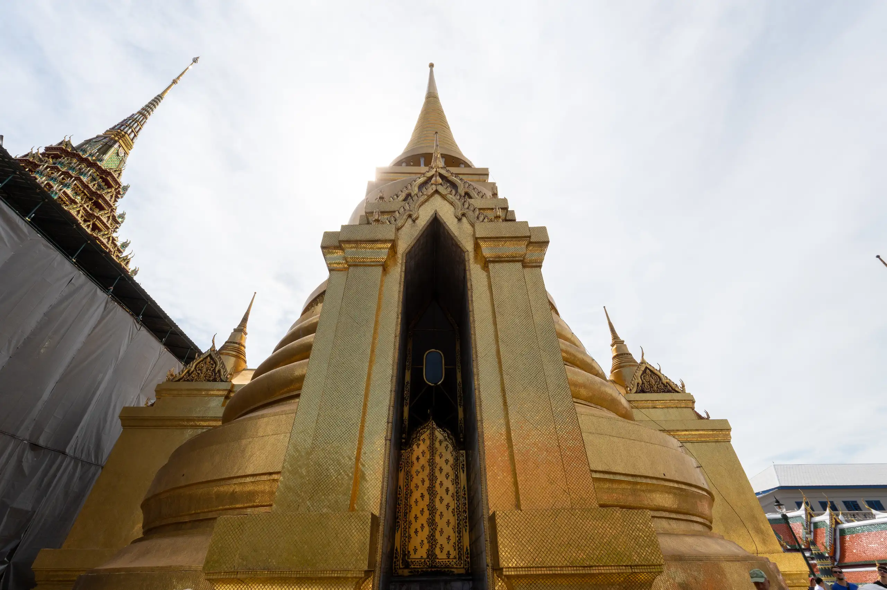
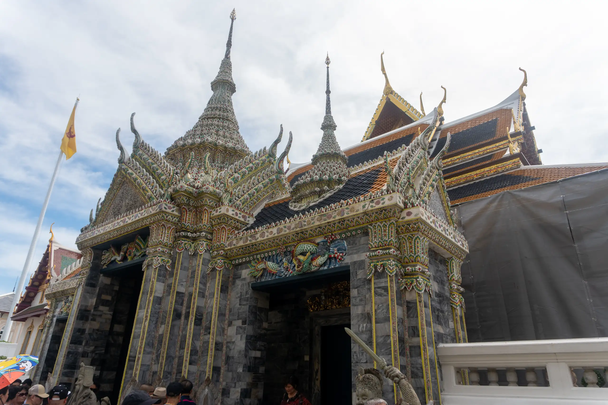
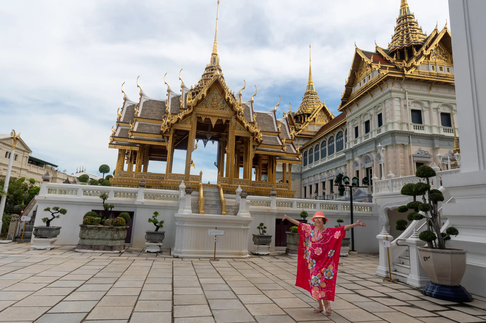

The [Bangkok Grand Palace พระบรมมหาราชวัง](https://www.royalgrandpalace.th/en/home) was constructed by King Rama I as a royal residence covering an area of 218,000 square metres that are enclosed by crenallated walls measuring 19,000 metres. It is laid out with Halls of Residence and Throne Halls as well as administrative buildings and a temple that serves as the Chapel Royal.

Rama I had eight prang or corncob towers on the east of the temple constructed to function as a Chedi monument worthy of veneration (Phra Asada Maha Chedi). The plastered brick chedi are decorated with stucco motifs and glazed tiles of differing colours and dedicated to eight Buddhist concepts.

The Prasad Phra Thepbidon Royal Pantheon is a building that has a Prang or corncob spire surmounting its roof. Geometric patterns of coloured glass mosaics adorn its exterior walls and pillars that are interspersed with ceramic tiles.

Two golden stupas, titled Phra Suwannachedi (พระสุวรรณเจดีย์), are situated to the east of the terrace, flanking the steps leading up to the Prasat Phra Thep Bidon - this is one of them:

The Phra Ubosot (Convocation Hall) is constructed in the midst of a chest height boundary wall with eight double-sema boundary stones that mark a consecrated area and the double-sema boundary stones signify that the temple was constructed by a king.

The Emerald Buddha that is considered to be an object of national veneration is carved from a block of jasper in the attitude of meditation and is enshrined high up on a tiered base in an altar of gilded wood designed to represent the Busabok aerial chariot of heavenly beings.

Seven pairs of mythological figures decorate the terrace, made of bronze and gilded with gold leaf. These are half-animal half-human celestial beings which, according to tradition, inhabited the mythical Himavanta forest. Two examples are the Theppaksi, human male upper body with feathered arms, bird lower body, human feet and holding a sword; and Apsarasingha (Apsonsi), human female upper body and lion lower body.

Phra Mondop is a traditional square building with mother-of pearl inlay doors topped by a Thai mondop spired roof was constructed by Rama I to hold a large lacquered mother-of-pearl inlay cabinet containing palm leaf Buddhist Tripitaka scriptures. The exterior walls are covered in glass mosaic and around the base are rows of gilt-stucco Thepanom folded-palm deities atop a row of Asura giants interspersed with mythical Garudas.

The Phra Sawet Kudakhan Wihan Yot (พระเศวตกุฏาคารวิหารยอด) or the Wihan Yot extends northwards from the terrace. The building, a vihara, serves as a Buddha image hall, and was first built by Rama III to house many important Buddha images.

Bronze figures of Tantima birds—birds with a human torso and Garuda head—guard the entrances on the west and east sides.

Phra Sri Rattana Chedi is a bell-shaped chedi or stupa of brick and mortar that was constructed in 1855 during the reign of Rama IV to house relics of the Buddha was originally white-washed but was later covered with gold mosaic tiles imported from Italy during the reign of Rama V in time to mark the centenary of Bangkok in 1882.

Four small gilt-bronze busabok (Phra Barom Sanyalak Busabok) that are elevated on marble plinths around the Phra Mondop contain gilt-bronze emblems of the former nine Kings of the Bangkok period. At the base of each busabok are bronze elephant statues on marble bases that represent the auspicious white elephants consecrated in each of the reigns.

Six pairs of statues of Asura or giants are placed as guardians with their backs to the gates inside the temple compound facing the Phra Ubosoth to show deference to the Emerald Buddha. These are two of them:

The belfry or bell tower is decorated in floral and foliage patterns with bits and pieces of broken imported Chinese porcelain was begun in the reign of Rama IV to replace the belfry that was built by Rama I and was completed in time for the Centenary of Bangkok in the reign of Rama V.

The Ho Sastragom Hall was built by Rama IV on the foundations of a former building of the reign of Rama I and was used as a chapel and to store auspicious items and talismans for warfare.

The Phra Maha Monthien
The Phra Maha Monthian residential complex inside boundary walls was constructed by King Rama I and consists of the Chakkraphat Biman Royal Residence, the Debhasatharn Bilas Hall, the Deba-asana Bilai Hall, the Baisal Daksin Hall, and the Amarindra Vinijaya Throne Hall. All the buildings are connected and include the Ho Phra Suralai Biman and the Ho Phra Dhat Monthian.

The Grand Palace itself, the Phra Thinang Chakri Maha Prasad, has reception rooms, dining hall and a Throne Hall. The building is in the neo-classical style with a roof surmounted by three Thai-spired Prasad instead of the three domes as stipulated by John Clunich the British architect.

The Dusit Maha Prasad Throne Hall is enclosed by boundary walls as it is part of the residential complex built by Rama I. This brick plastered Throne Hall with a Prasad spired roof with red Garuda clutching the heads and seizing the tails of two Naga serpent statues at the four corners of the seven-tiered Maha Prasad roof replaced the Phra Thinang Indrabhisek Throne Hall that was built in wood and was destroyed in the fire that was caused by a lightning strike in 1789.

Rama IV built the Abhorn Bimok Pavilion behind the west boundary wall of the Phrathinang Dusit Maha Prasad complex as a robing pavilion prior to mounting or after dismounting a palanquin.

This is a video of the regimental march:

<iframe width="560" height="315" src="https://www.youtube.com/embed/OOuDV1h4gwo?si=bQQA5liSKIwcPmzS" title="YouTube video player" frameborder="0" allow="accelerometer; autoplay; clipboard-write; encrypted-media; gyroscope; picture-in-picture; web-share" referrerpolicy="strict-origin-when-cross-origin" allowfullscreen></iframe>
