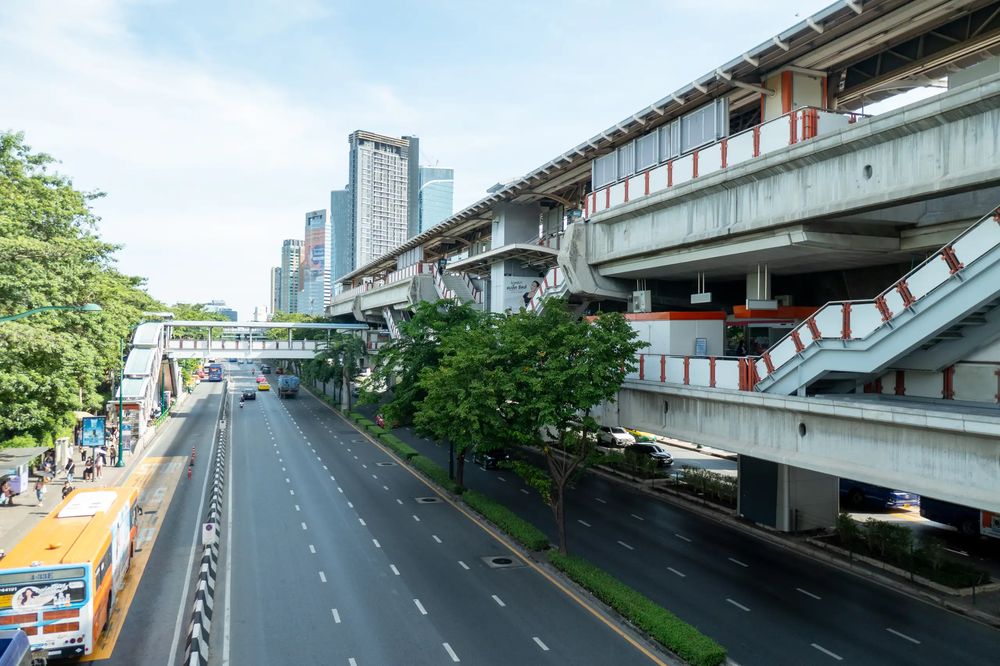
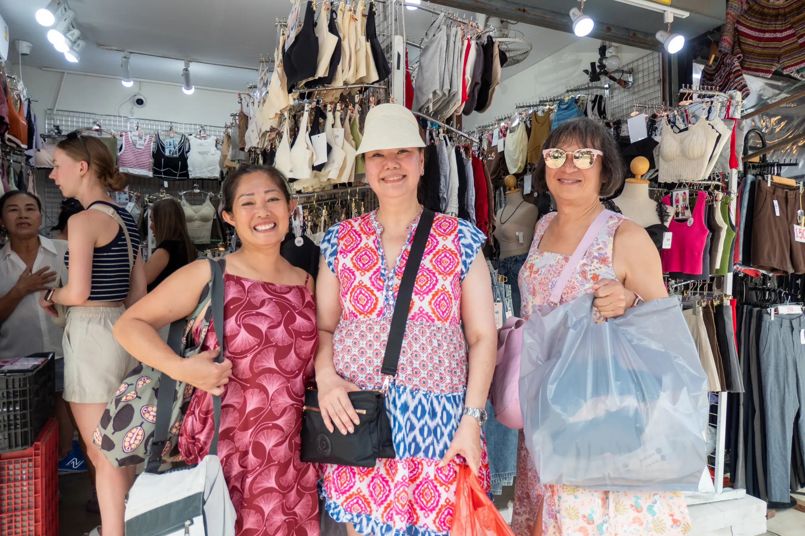
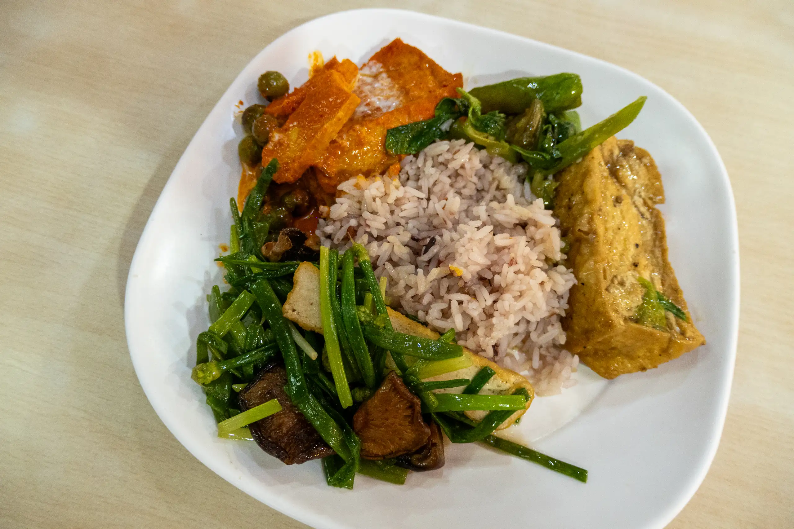

With over 200,000 people flocking into [Chatuchak Weekend Market](https://www.chatuchakmarket.org) ตลาดนัดจตุจักร every weekend, this has become the World’s largest Weekend Market. The Market has over 15,000 stalls which are spread across 35 acres and 26 sections which range from Food, Art, Antiques, Fashion and much more.

Getting here was a challenge, and involved taking the BTS to Mo Chit Station and it was quite far from where we stayed.

We all bought a lot of bras at a lingerie shop here because the woman was very helpful in choosing sizes for us.

After that, we wandered off to JJ Mall in search of Thai silk outfits. We had lunch at JJ Mall and it was my first opportunity to try vegetarian food which I enjoyed.

After lunch, I wandered off by myself because I wasn't very interested in Thai silk. I probably covered only 10% of the market, there were that many stalls and little lanes, but it was exhausting, so I eventually made my way to Kamphaeng Phet monorail station and returned back to the apartment.
